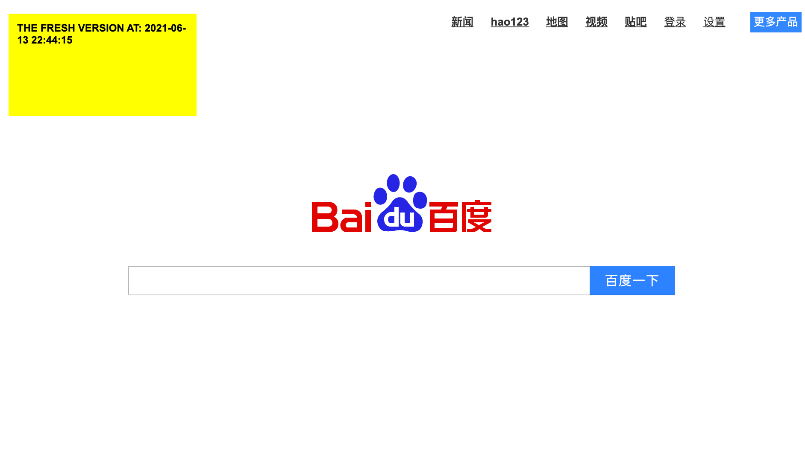
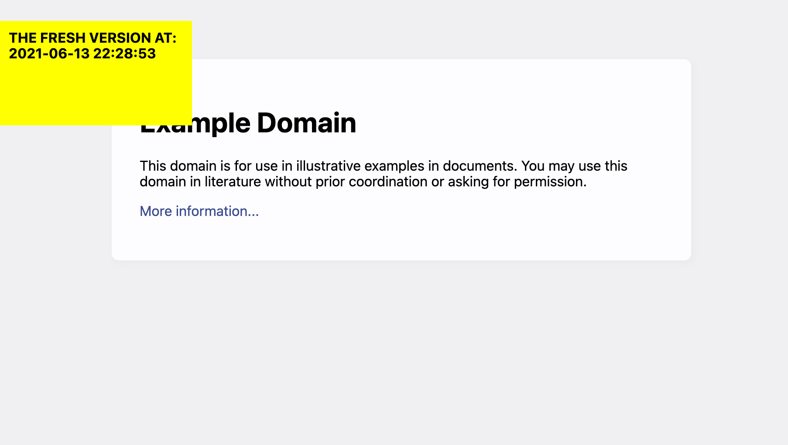

# Proxy Sever

CSC358A1: A implementation of a small web proxy which is able to cache web pages. 

## Sample
```
python3 proxy.py 120 // 120 indicates the cached item expires 120 after it's created
``` 
In you browser type http://localhost:8888/www.baidu.com 

The proxy will first cache the website and inject a yellow box with text to show the version of the website. 

Note this proxy doesn't work for HTTPS, only work for HTTP website.




http://localhost:8888/www.example.org



## Contribution
This assignment was done by [Abdulwasay Mehar](https://github.com/masterrom) and [Haotian Yang](https://github.com/Haotian-Yang)
